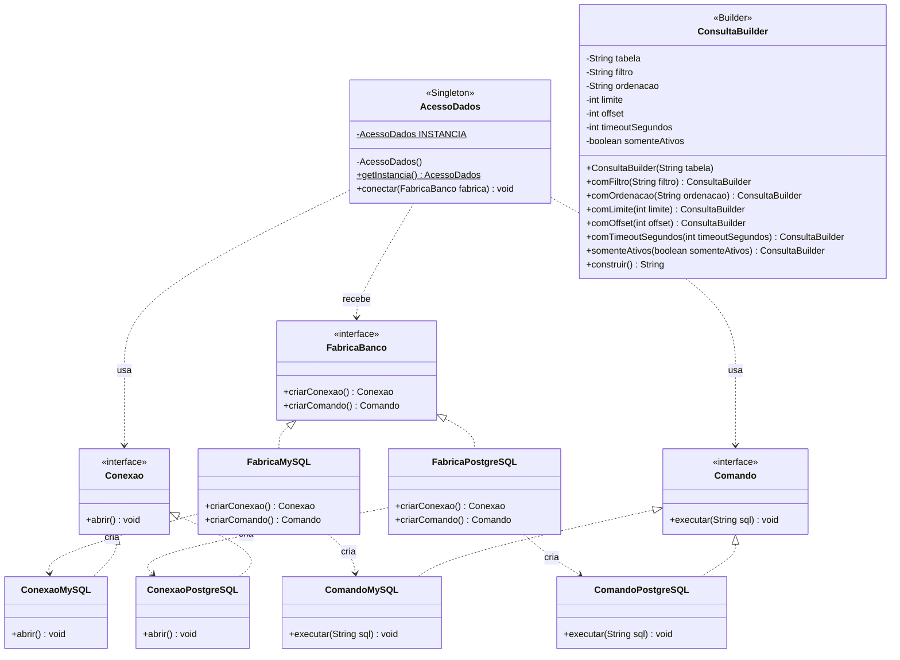

```mermaid
classDiagram
    direction TB

    class FabricaBanco {
        <<interface>>
        +criarConexao() Conexao
        +criarComando() Comando
    }

    class FabricaMySQL {
        +criarConexao() Conexao
        +criarComando() Comando
    }

    class FabricaPostgreSQL {
        +criarConexao() Conexao
        +criarComando() Comando
    }

    class Conexao {
        <<interface>>
        +abrir() void
    }

    class ConexaoMySQL {
        +abrir() void
    }

    class ConexaoPostgreSQL {
        +abrir() void
    }

    class Comando {
        <<interface>>
        +executar(String sql) void
    }

    class ComandoMySQL {
        +executar(String sql) void
    }

    class ComandoPostgreSQL {
        +executar(String sql) void
    }

    class AcessoDados {
        <<Singleton>>
        -AcessoDados INSTANCIA$
        -AcessoDados()
        +getInstancia() AcessoDados$
        +conectar(FabricaBanco fabrica) void
    }

    class ConsultaBuilder {
        <<Builder>>
        -String tabela
        -String filtro
        -String ordenacao
        -int limite
        -int offset
        -int timeoutSegundos
        -boolean somenteAtivos
        +ConsultaBuilder(String tabela)
        +comFiltro(String filtro) ConsultaBuilder
        +comOrdenacao(String ordenacao) ConsultaBuilder
        +comLimite(int limite) ConsultaBuilder
        +comOffset(int offset) ConsultaBuilder
        +comTimeoutSegundos(int timeoutSegundos) ConsultaBuilder
        +somenteAtivos(boolean somenteAtivos) ConsultaBuilder
        +construir() String
    }

    FabricaBanco <|.. FabricaMySQL
    FabricaBanco <|.. FabricaPostgreSQL

    Conexao <|.. ConexaoMySQL
    Conexao <|.. ConexaoPostgreSQL

    Comando <|.. ComandoMySQL
    Comando <|.. ComandoPostgreSQL

    FabricaMySQL ..> ConexaoMySQL : cria
    FabricaMySQL ..> ComandoMySQL : cria

    FabricaPostgreSQL ..> ConexaoPostgreSQL : cria
    FabricaPostgreSQL ..> ComandoPostgreSQL : cria

    AcessoDados ..> FabricaBanco : recebe
    AcessoDados ..> Conexao : usa
    AcessoDados ..> Comando : usa
```